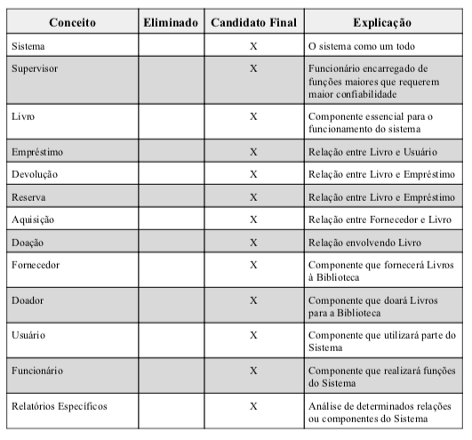
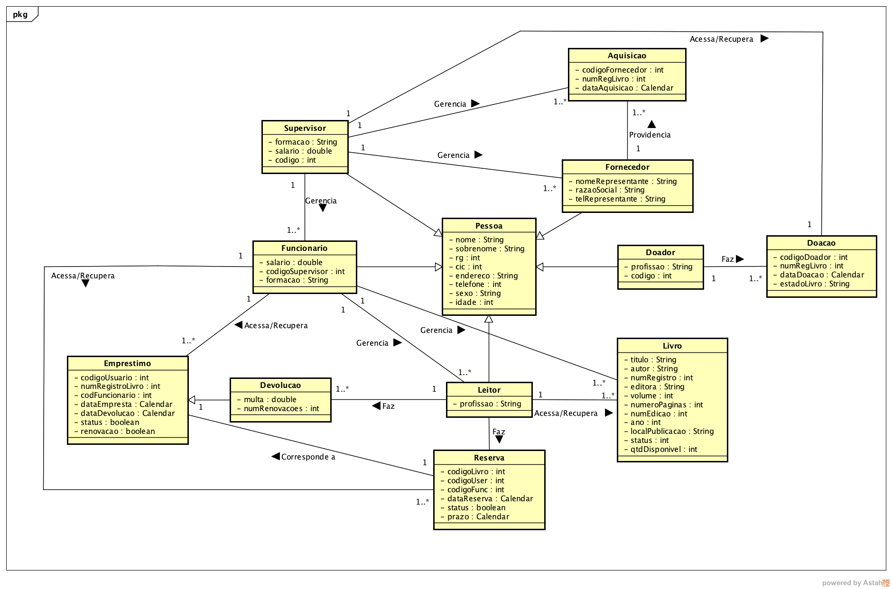
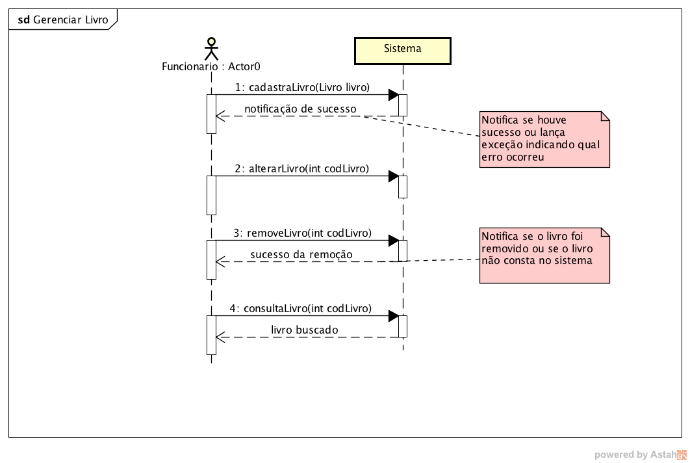
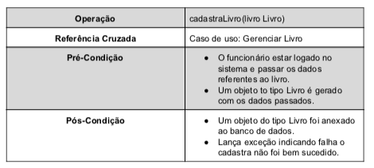

# UML Conceptual Model and Sequence Diagram (Library system)

OVERVIEW
--------------------------------------------------
This is the second part of the UML library system project for the [Oriented Object Project and Analysis] course. The purpose of the project was to make a conceptual model and sequence diagram of a library system according to a requirements document with the aid of a Computer-Aided Software Engineering (CASE) application. It was made at the Computer Science undergraduate program from University of São Paulo (ICMC - USP).

TASKS
--------------------------------------------------
```bash
  1. Construct the Conceptual Model of the system considering the Requirements Document and the artifacts built in the first project. Construct the model following the steps given in the classroom, that is, identify the nouns, the verbs and eliminate the nonsignificant ones. Then construct the model including these concepts and their associations / attributes.
  2. Construct the System Sequence Diagrams (DSSs), considering the use cases described in the complete and abstract format elaborated in Work 1.
  3. Construct the operating contracts of four operations belonging to any of the DSSs of item 2. Choose operations that contain relevant logic, ie, there must be postconditions (the note depends on the choice!).
```

PROJECT
--------------------------------------------------
This project consists of the modeling of a library management system that has functions for the management of books, employees and users, control of loans and returns, acquisition and donations of books to the library.
Operations in the program are performed only by library staff and supervisors, and a supervisor is able to perform all the functions of an employee, plus some additional library management operations such as employee management, supplier registration.
In this document are included: the conceptual model, system sequence diagrams, operations contract and brief conclusions.

EXAMPLES
--------------------------------------------------





MORE INFO
--------------------------------------------------
* Please check the files: `project report.pdf` and `Requirements Document.pdf` to view the project.
* UML Sequence Diagram: <https://en.wikipedia.org/wiki/Sequence_diagram>